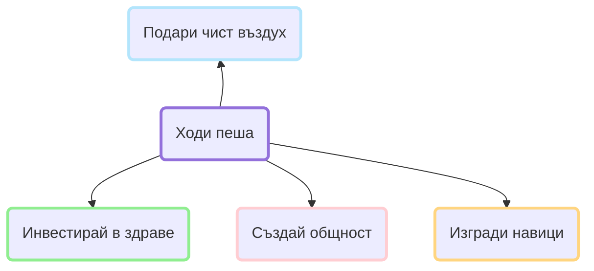

# Добре дошли

Ние сме група ентусиасти, които силно вярваме, че движението е в основата на едно
усмихнато ежедневие. То води, някак естествено, към по-отворена комуникация и динамичен
начин на живот. Нашата цел е да помогнем за създаването на по-здраво и щастливо общество
чрез едно от най-присъщите ни неща - *ходенето*.

- :lucide-group: __[НПО]__ – Пешачко ще бъде сдружение в обществена полза. В момента
  подаваме документи за регистрация на неправителствена организация.
- :fontawesome-solid-leaf: __[Нашият град]__ –
  Инициатива за чист въздух и здраве.
- :lucide-users: __[Събития]__ – Всяко събите е възможност за промяна -- а колко ни е
  необходима тя!
- :lucide-house: Семейството – Разходка заедно ...

<section style="text-align: center;">

</section>

Това е нашата страница. Тук ще намерите информация за минали и планирани събития,
както и кратки статии на теми които са ни мотивирали по някакъв начин.

Всяка стъпка има значение ...

<figure markdown="span">
  { width="300" }
</figure>

[НПО]: ngo.md
[Нашият град]: environment.md
[Събития]: events/events.md
